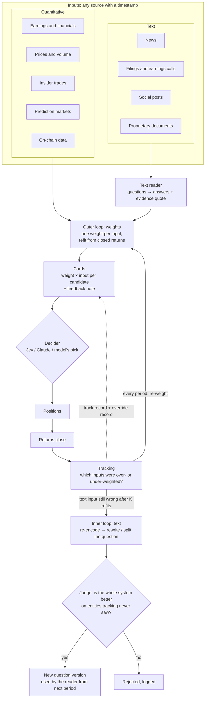

# project-new-gen-investing

**An agentic investing system that learns how much a decision agent should trust each piece of
information, and keeps re-learning as results come in.**

You give it inputs: numbers (financials, prices, insider trades) and text (filings, news, posts, or
your own documents). An AI reader turns each document into structured answers, each backed by a
quote from the text. A model then weights every input by how well it has predicted returns, using
only data that existed at the time. A decision agent (Jev, Claude, or the model's own pick) sees
those weights on a card for each candidate and makes the call. When returns come in, the weights are
re-learned, and text questions that keep misleading the model are rewritten. Every test is logged
against a bar that rises with each attempt, so the system can't fool itself.

On public US stock data from 2011–2019 the loop works as designed, but no signal survived trading
costs ([docs/FINDINGS.md](docs/FINDINGS.md)). It is built to be pointed at better data, especially
proprietary text. Run `uv run engine demo` to watch it learn on a synthetic market, no keys needed.

## Why no edge so far

Each reason is tied to a logged result ([docs/FINDINGS.md](docs/FINDINGS.md#why-no-edge-so-far)):

1. **Public news is priced fast.** An LLM's reading of a filing explains much of the 3-day price
   reaction to it (rank IC 0.16), but that edge is gone by the next open.
2. **Costs are bigger than the edge.** A model over numbers and earnings text ranks next month's
   winners above its losers (rank IC t 4.7), but measured trading costs took 43–54% of the gross
   return, and holding longer to trade less didn't rescue it.
3. **Everyone has the same data.** Only public sources were used (SEC filings, prices, insider
   trades, news). Those who win usually have speed, scale, cheap execution, or data others don't.
4. **The bar is strict on purpose.** After 173 counted tests a result needs t ≥ 3.6, so a weaker
   real effect (industry momentum, t 2.6) can't be proven with this much history.
5. **AI-read backtests are compromised.** The model may remember what happened in 2011–2019.
   Masking company names reduces this but can't remove it, so forward paper trading is the honest
   test.

What the engine is for: a fast, honest verdict on new data, such as proprietary text.

## The feedback loop

The core idea: give every input a weight, act on it, see what the returns say, re-weight, and go
again. `engine loop` runs this period by period over the tuning years, as if live.



One period:

1. **Weigh.** The outer loop refits one weight per input (every number and every text answer)
   from returns that have already closed.
2. **Show.** Each candidate gets a card: its inputs, weight × value for each, and a note on which
   inputs have earned trust so far.
3. **Act.** The decider picks: Jev or Claude if configured, otherwise the model's own top pick.
4. **Observe.** The period ends and its returns close.
5. **Track.** Compare what the weights expected with what happened: which inputs were over- or
   under-weighted, mis-shaped, or fading?
6. **Fix.** The next refit re-weights everything. A text field that stays wrong for K refits goes
   to the inner loop (re-encode its answer, then rewrite or split its question), and a change is
   kept only if the whole system does better on entities the tracking never looked at.

```
outer loop   every period   all weights, refit from closed returns
inner loop   rarely         text fields: re-encode -> rewrite / split the question
coordinator  between them   weights first, one change per period, K refits of proof,
                            one end-to-end judge, rollback and oscillation brakes
```

```bash
uv run engine loop --market demo           # descriptive: prints the weights, changes, ON vs FROZEN
uv run engine loop --market mine --log     # ONE registry test (pre-register loop.name in the YAML)
```

It writes three files to `results/<market>/`:
- `loop_weights.csv`: one row per period and input (`period, input, weight, config`). `weight` is
  what that period's decisions used, on centred percentile ranks, so weights compare across
  inputs: 0.10 means moving an input from the middle to the top of the ranking adds 0.05 to the
  predicted return rank. A new `config` marks an accepted change. Read it as a table with
  `pd.read_csv(path).pivot(index="period", columns="input", values="weight")`.
- `loop_changes.csv`: every judged change and brake: loop, rung, field, trigger, t vs bar, accepted.
- `loop_returns.csv`: per period, the portfolio net of costs with the loop ON and FROZEN (no
  re-weighting beyond yearly refits, no text changes), rank IC, and the decider's pick vs the
  model's.

## Quickstart (no keys, no downloads)

Needs [uv](https://docs.astral.sh/uv/) (`curl -LsSf https://astral.sh/uv/install.sh | sh` or
`brew install uv`). Using an AI coding agent? Point it at this repo and say "try it out":
[AGENTS.md](AGENTS.md) gives it the steps and the expected results.

```bash
uv sync
uv run engine demo        # ~2.5 min: the whole system on a synthetic market, ending with the loop
uv run pytest -q          # ~3 min
```

What correct looks like: in the demo's last section, `x_value`'s weight climbs from about 0 to
about 29 (x100) against a true value of 30, and in the trap case it falls from about 50 to about 5
while the demand question is left alone; every test passes. The full step-by-step table, with the
expected number at each step, is "try it out" in [AGENTS.md](AGENTS.md#if-the-user-says-try-it-out).

## Try your own data in 3 steps

1. Write `prices.csv` (`entity, date, close`, optional `volume`, `group`) and, for your signal,
   `signals.csv` (`entity, available_at, feature, value`). `available_at` is when the value became
   public, never the period it describes. Documents go in `documents.csv`
   (`entity, available_at, doc_type, text`) with a question set (see `examples/csv/`).
2. Copy `markets/csv_example.yaml` to `markets/mine.yaml`; point `csv:` at your files; set the
   calendar (`trading` or `continuous` for 24/7), schedule, horizon and periods. Pick the periods
   before you look at any result.
3. Run it:

```bash
uv run engine build  --market mine                      # panel, point-in-time check, coverage
uv run engine report --market mine --features all       # descriptive, never logged
uv run engine test   --market mine --feature my_signal  # ONE judged test, logged either way
uv run engine loop   --market mine                      # the feedback loop over time
```

The shipped example (30 tokens trading 24/7, planted signals) runs the same way:
`uv run engine test --market csv_example --feature flow` is kept; `--feature social` (noise) is not.

## What each file does

| file | what it does |
|---|---|
| `src/engine/data.py` | the observation and document contracts, calendars (trading, 24/7), the point-in-time checker |
| `src/engine/panel.py` | decision schedule x universe -> the latest value of every input before each decision, plus labels |
| `src/engine/model.py` | walk-forward models over per-period ranks; training labels always end before the test period |
| `src/engine/score.py` | the one scorer: rank IC, spreads, portfolios net of costs, t-statistics, overlapping cohorts |
| `src/engine/registry.py` | every judged test, the rising bar, the rationed check period, the locked holdout |
| `src/engine/run.py` | market YAML -> Study; build, report, test, discover, the long-horizon cohort test |
| `src/engine/spend.py` | caps and a ledger for every paid AI call |
| `src/engine/market.py` | what a market plug-in must provide |
| `src/engine/decide.py` | optional AI decider over the model's cards, with a feedback note from closed periods |
| `src/engine/improve.py` | the feedback loop: `run_loop`, the outer step (weights), the inner step (text), the coordinator's judge and brakes |
| `src/engine/cli.py` | the `engine` command (demo, loop, build, report, test, discover, grade-text) |
| `src/engine/text/questions.py` | question sets as YAML: typed, tagged reading / judgment, versioned |
| `src/engine/text/read.py` | masking names, readers (keyword free; Jev, Claude paid), the cached, capped reading service |
| `src/engine/text/source.py` | documents -> answers -> level / change / surprise inputs; history base rates |
| `src/engine/text/grade.py` | is each question worth asking: answer key, probes, reaction and drift over a prior, leak gate |
| `src/engine/text/tracking.py` | is a field under- or over-weighted, mis-shaped, decaying or misread |
| `src/engine/text/improve.py` | the question-improvement loop, and the question split the feedback loop's inner step uses |
| `src/engine/markets/demo.py` | one synthetic market (numbers + documents with planted signals): the demo and the tests |
| `src/engine/markets/csv.py` | bring your own data from CSV files, no code |
| `src/engine/markets/us_stocks/` | US small and large caps: universe, EODHD prices and measured spreads, SEC filings, insiders, 8-K text |
| `markets/*.yaml`, `markets/questions/` | one config per market; question sets |
| `examples/csv/` | the CSV example's data, its question set and the script that generated it |
| `data/registry_aggregate.csv`, `data/engine/*/registry.csv` | every judged test so far (aggregate statistics only) |
| `docs/HOW_IT_WORKS.md` | the data flow, contracts, adding a source or market, text scoring, the loops, readers |
| `docs/FINDINGS.md` | every experiment and its result |
| `AGENTS.md` | the brief for an AI agent working in this repo |

## Where results go

- `engine loop` writes `results/<market>/loop_*.csv` (above) and prints a summary.
- `engine report`, `test`, `discover` print JSON to stdout; progress goes to stderr.
- Judged tests: the market's registry CSV (`registry.file` in its YAML; `data/engine/<market>/` for
  research markets, `.engine_cache/<market>/` for the demo and CSV example).
- Holdout looks: the YAML's `holdout_unlock_log`. Paid calls: `data/costs.csv`.
- Panel and answer caches: `.engine_cache/` (git-ignored, safe to delete).

## Honesty rules

- **Point in time**: an input may be used only if `available_at` is strictly before the decision;
  labels start strictly after it. Every panel is checked.
- **Every judged test is logged**, kept or not, and raises the bar for the next (Bonferroni over all).
- **Check periods are rationed and the holdout is locked**, by the code, not by memory.
- **Costs are counted**: every portfolio number is net, and dead entities stay in the universe.
- **Every layer must beat the version without it**, and every component is tested on a planted
  signal it must find and on noise it must not.

Optional paid readers and deciders: `uv sync --extra llm` and keys in `.env` (copy `.env.example`).
The US stock plug-in fetches its own data with your keys (`engine build --fetch`).

No license: all rights reserved. Ask the owner before reusing the code.
