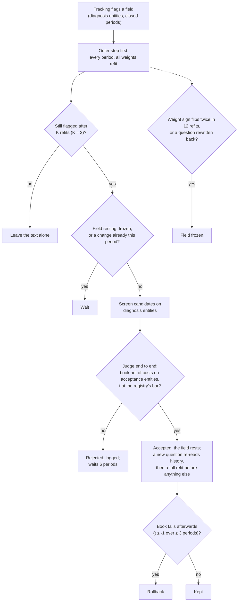

# How it works

The engine answers one question for any input: **known before the decision, does it rank the next
period's winners above its losers, after costs, more often than luck allows?** Every candidate goes
through the same pipeline and the same judge, and every judged attempt is logged. Around that
pipeline runs the feedback loop (section 4): weight every input, act, observe, re-weight.

```
 Sources ──► observations ──► Panel builder ──► rows ──► Walk-forward model ──► Scorer ──► Registry
 numbers,    entity_id,       latest value per   label,   ranks in, one score   IC, spreads,  every test,
 documents   available_at,    input with          target,  per row, trained on   portfolios,   the bar,
 (+ readers) feature, value   available_at < T    costs    closed labels only    net of costs  check gate,
                                    ▲                                                          holdout lock
 Market plug-in ────────────────────┘  universe(as_of), labels, cost_bps, calendar, groups
```

## 1. Contracts

Each module's docstring is the authoritative version.

**Observations** (`engine/data.py`), one row per (entity, moment, feature):

| column | meaning |
|---|---|
| `entity_id` | the market's id for the thing being ranked (a stock code, a token) |
| `available_at` | **UTC** time from which a decision may use the value: publication, or later if the source adds a lag. Never earlier. Naive times are rejected |
| `source`, `feature` | names; a feature name is unique across sources |
| `value` | a float. `NaN` means "the latest report had no value", so it masks older values |

Ties (same entity, feature and `available_at`): the row emitted last wins. A **Source** has `name`,
`fetch(start, end)` (fill your own cache; the only step that may use the network) and
`observations(start, end)` (read the cache). Values cheapest to compute where needed (momentum from
bars) may come from `observations_at(rows)` instead. Window features ("insiders buying in the last
182 days") use `data.rolling_window()`, which emits an observation each time an event enters or
leaves the window, so "latest value before T" reproduces the window exactly.

**Documents**: `entity_id, available_at, doc_type, doc_id, text` (+ optional `metadata`), the text
already masked. Question sets are chosen by `doc_type`; "the previous document" is the previous one
of the same type. A **DocumentSource** has `fetch` and `documents(start, end)`.

**Market** (`engine/market.py`): `universe(as_of)` (who is tradable then, dead entities included;
optional `group`), `labels(rows, horizon)` (enter at the close of the first bar closing after the
decision, exit `horizon` bars later; a series that stops for good earns its delisting outcome, an
unfinished window is `NaN`; `market.forward_returns()` implements this once), `cost_bps(rows)`
(round trip; `NaN` = unknown, filled with the median and said so), and a `calendar`: `trading`
(business days, a session close, decisions just after it) or `continuous` (24/7).

**Panel** (`engine/panel.py`): for each decision time T and each entity in `universe(T)`, every
feature's latest observation with `available_at < T` (blanked if older than its `max_age_days`),
the label, and the `available_at` behind every filled cell. `data.check_panel` re-reads that
provenance and every label's entry time; a failure stops the run. `panel.model_rows` keeps labelled
rows, winsorizes the label if asked, adds the target `fwd_rank` (the forward return's percentile
within decision time and group) and round-trip costs.

**Model** (`engine/model.py`): inputs are per-period percentile ranks centred at 0 (missing = 0);
the target is demeaned within the group. Ridge (alpha 10) is the default, trees the other built-in;
anything with `fit` / `predict` plugs in. `WalkForward` refits once per block (a calendar year by
default) and trains only on rows whose **label had ended** before the block's first decision. An
optional recency half-life (`auto` = chosen once a year, moving at most one step) weights recent
periods more.

**Scorer** (`engine/score.py`), one for everything: per decision time, then a t over decision times
(deflated by the label overlap):
- rank IC: Spearman of score vs the group-adjusted forward return;
- quantile spreads: top minus bottom decile within each group, gross and net of the round trips of
  names entering each leg;
- long-only portfolios vs the equal-weight universe: `band` (enter above `enter`, hold until below
  `exit`), `topk`, `periodic`; half a round trip per buy and per sell;
- overlapping cohorts for long holds (buy a list each formation, hold N formations), Newey-West t.

**Registry and periods** (`engine/registry.py`): every judged test is a row in the market's
registry CSV, kept or not. The bar is Bonferroni over every judged test so far, inherited registries
included: 1.96 at the first, 2.81 at the 10th, 3.44 at the 85th (the next, here). Each market declares:

| period | rule |
|---|---|
| tuning | everything is designed and judged here |
| check | opened only for a candidate that clears the tuning bar, through `registry.open_check()` (counted, each look raises the check bar, hard limit 30); the loop sees pass / fail only |
| holdout | locked; `engine report --final` asks for a reason and logs it with the commit before reading a row |

**Tests and discovery** (`engine/run.py`): a candidate is a feature, a transform (`level`, `chg<k>`,
`pct<k>`, `log`; transforms read only the entity's own earlier rows) and a scope (`universal` or
one group). The judge runs the walk-forward with and without it; the statistic is the per-period
difference in rank IC (with an empty baseline, the candidate's own rank IC). It must reach the
registry's next bar; then the check period opens and `kept` needs the check bar and a positive
check-period gain. `discover` proposes candidates (the YAML's list, or every feature x transform)
until one is kept or a stop rule fires. A YAML `cohort_test:` block pre-registers a fixed composite
held for years; `engine test` with no feature runs it once and logs it.

## 2. Add your data

**CSV first** (`engine/markets/csv.py`, no code): `prices.csv` (`entity, date, close`, optional
`volume`, `group`), optional `signals.csv` (`entity, available_at, feature, value`) and
`documents.csv` (`entity, available_at, doc_type, text`) read by a question set. Costs are a constant
`cost_bps`; a series that stops is a delisting (`delisted_return`). `available_at` with a time zone
is used as is, a date alone becomes usable at the next local midnight, a naive time is read in the
calendar's zone. Copy `markets/csv_example.yaml`, then `engine build` prints coverage and runs the
point-in-time check.

**A source in a plug-in**:
1. A class with `name`, `fetch(start, end)` and `observations(start, end)`, in the plug-in's source
   table (the dict `build()` returns).
2. Stamp `available_at` honestly. When could a trader first have seen it (a quarter ending March 31
   is known when it is filed in May)? Is the zone explicit (`calendar.date_available` for dates)?
   Does the vendor restate history (store first-published values)?
3. Emit `NaN` rows when a report exists but lacks the field, so stale values don't show through.
4. List it under `sources:` with `features`, `max_age_days`, `params`; test it like
   `tests/test_panel.py` (a value stamped exactly at the decision must not appear).

**A market plug-in**: a module under `engine/markets/` (or a dotted path in `plugin:`) with a class
implementing the market contract and `build(cfg) -> (market, {source name: factory})`. `demo.py` is
a complete synthetic one, `csv.py` a small real one, `us_stocks/` a full one (two YAMLs share it:
small and large caps differ only in universe list, cost table and `data_end`). Then a YAML: calendar,
universe rules, label horizon, sources, feature sets (`baseline` is what every candidate must beat),
model, portfolio rules, periods (**decided before looking at results**), registry.

## 3. Text

```
 DocumentSource ──► masking ──► reader (keyword | Jev | Claude) ──► answers ──► level / change / surprise
                                cache + estimate + spend cap                     observations ──► panel
                                eval harness: answer key, probes, reaction and drift over a prior ──► question loop
```

A text source is a `type: text` entry under `sources:` with `documents`, `questions`, `reader`,
`prefix`, `change` and `surprise` (`engine/text/source.py`).

**Questions** (`text/questions.py`, one YAML per doc_type or a bundle of doc_types sharing blocks):
each is a `choice`, `scale` (0-4 with five anchors), `yes_no` or `probability`, tagged `reading`
(answerable from the text, graded against an answer key) or `judgment` (needs context; graded only
by markets). Any wording change bumps the version; answers stay attached to the version that made
them. For literal readers: one condition per statement, no arithmetic or dates.

**Masking** (`text/read.py`): a reader trained after the test period may remember what happened to
a named company, which is look-ahead. Masking replaces full names (current and former), the
ticker, distinctive first words, capitalized dictionary-word names, and optionally brands, drug
stems, development codes and trial acronyms with COMPANY_A. It is a guard, not a proof: the leak
gate measures what still leaks.

**Readers**:

| reader | cost | needs | use |
|---|---|---|---|
| `keyword` | free, deterministic | nothing | tests, the demo, keyless users, the baseline a paid reader must beat |
| `jev` | input tokens (jev-1.13.0: $0.042 / 1M) | `TYPESAFE_API_KEY`, `uv sync --extra llm` | typed answers at scale (cannot quote) |
| `claude` | input + output tokens | `ANTHROPIC_API_KEY`, `uv sync --extra llm` | answers with verified quotes (a quote not in the text is retried once, then dropped) |

Every reading goes through `read.read_all`: a content-hash cache (same text + question version +
reader is never paid twice), a printed cost estimate before the first paid call, a refusal if it
exceeds what is left under the step's cap, and guards per chunk that also check loaded funds
(`spend:` in the YAML).

**Answers to inputs**: per document, the level (`_level` for scales, `_p` for yes/no, one column per
option); per entity and doc_type in publication order, the change vs its previous documents (`_chg`)
and the surprise vs the base rate among strictly earlier documents (`_surp`, shrunk toward coarser
keys). Each value carries its document's `available_at`, so the panel rules apply unchanged.

**Is a question worth asking?** (`text/grade.py`, `engine grade-text`). Three sets on tuning-period
documents, split dev / test by entity: an answer key (two labelers, a spot-check export), probes
(paraphrase, alternative mask, unmasked, order shuffles, one-change counterfactual edits) and a
market set (3-day reaction in sigma units, later drift). Reaction and drift are scored as the
card's **gain over a history prior** (event type + base rates of earlier similar events), out of
fold by year. `S = 0.30 A + 0.25 B + 0.30 C + 0.10 D + 0.05 E`: A answer-key skill on reading
fields only, B probe consistency, C reaction gain, D drift gain, E coverage. Gates: the outcome probe
may not beat the reader's own good/bad reading by more than 0.05 AUC; masked-name identification
must stay at chance. `question_efficacy` adds a keep / drop per question.

**Question loop** (`text/improve.py`): one change at a time (reword, new question, split, drop;
at most 3 questions), validated, re-read on dev (only changed questions miss the cache), accepted
only if the lower bound of a 95% entity-bootstrap of dS is above 0, every gate passes and the set
barely grows. Every attempt is logged; it stops after 30 iterations, 8 rejects in a row, 5 tiny
gains, the spend cap or a leak. The test split opens at most 3 times; a pass freezes the set. The
free `KeywordProposer` mines phrases from misread documents; `ClaudeProposer` is paid and off by
default.

## 4. The feedback loop

The centerpiece (`engine/improve.py`, `engine loop`): give every input a weight, act, observe the
returns, re-weight, try again. `run_loop` replays the tuning years period by period, as if live,
next to a FROZEN twin (the starting inputs, plain yearly refits, no text changes), and every period
both see only data that had closed.

**One period** (`Coordinator.cycle`):
1. **Weights (outer loop).** The walk-forward refits one weight per input, numbers and text answers
   alike, every `refit` period (monthly by default), on closed labels only; the ON system's recency
   half-life is fixed in advance (`loop.recency`, `auto` = chosen once a year).
2. **Cards and the decider.** Each candidate's card shows weight x input for its strongest inputs
   and a feedback note built from closed periods; the decider (`--decider`, or the YAML's) picks
   one per batch of 10, the model's own pick when none is set. The note never feeds back into the
   weights, so the decider runs over the loop's own scores after the replay (`decide.over_loop`).
3. **Returns.** The period's labels close; `loop_returns.csv` records the V1 portfolio (buy the
   group's top 10%, hold until out of its top 30%) net of costs, ON and FROZEN, the rank IC, and the
   decider's pick vs the model's.
4. **Tracking** (`Coordinator.track` -> `text/tracking.py`, free, diagnosis entities only):
   residual attribution (the model's miss regressed on the inputs, one at a time and **jointly**;
   the same sign as the weight = under-weighted, opposite = over-weighted), calibration by answer
   level (a 0-4 scale can carry the right average weight and be wrong at every level), rolling IC
   and decay, reading quality. Flags count per refit, not per cycle.
5. **Outer step** (`outer_step`): if anything is mis-weighted or decaying, a different recency or
   shrinkage for all weights may be judged. (The refit itself happens every period regardless.)
6. **Inner step** (`inner_step`), text fields only, and only after the flag persisted through K
   refits: `reencode` (one-hot or monotone steps for a mis-shaped scale), `rewrite_question` (the
   free `PhraseSplitter` in `text/improve.py` turns the 3-gram most specific to the documents
   behind the largest leave-text-out misses into a new yes/no question, re-reads every document
   with the source's reader under its spend cap, and attaches the answers point in time as a new
   version of the rows), `drop_useless` (a field with ~0 incremental value over 24 periods).

**The coordinator** keeps the two loops from fighting over the same symptom:



1. The inner loop's objective is its own job: reading quality and incremental information measured
   on the full model (joint attribution, with-vs-without gains), never a field's raw correlation
   with returns.
2. Weights first: an inner change is eligible only if the signal persisted through `persist_k` (3)
   refits.
3. At most one structural change per period, in one loop; after a question changes, history is
   re-read with the new version and a full refit runs before anything else; the field then rests
   `cooldown` (6) periods.
4. One judge (`judge_change`): any change must improve the end-to-end book net of costs on
   acceptance entities, at the bar (inside a loop, the registry's count plus every change judged so
   far).
5. Diagnosis and acceptance use different entities (a fixed hash split).
6. Brakes: rejected candidates wait 6 periods; `rollback_if_worse` undoes an acceptance the book
   didn't bear out; `oscillation_alarm` freezes a field whose meaningful weight flips sign twice in
   12 refits, `question_changed` one whose question is rewritten back toward an earlier version.
7. The decider's note reports only; nothing in the loops reads it.

**What the demo shows** (`engine demo`, section 6; `tests/test_improve.py`), 300 entities, monthly
refits, 2011-2014:
- x_value starts to matter in 2012: its weight goes from about 0 to 0.29, against 0.30 for a fit on
  the new regime alone. A one-time charge stops mattering: its weight goes from -0.20 to about 0.
  The U-shaped demand field is re-encoded by the inner loop. Loop ON beats FROZEN (t 4.8).
- The trap: numeric x stops mattering while text demand, 0.8 correlated with it, keeps a small
  effect of its own. One at a time, demand looks badly over-weighted (t -8.7 in the 1,000-entity
  test case) and a naive inner loop would rewrite it; jointly the error sits on x (t -8.8 vs -0.5). The loop moves x's weight
  from 0.50 to 0.05 and makes no change to the demand question.

**Outputs** (`results/<market>/`, or `results_dir` in the YAML): `loop_weights.csv` (one row per
period and input: the weight that period's decisions used, and the configuration in force),
`loop_changes.csv` (every judged change and brake, with loop, rung, trigger, t and bar) and
`loop_returns.csv` (per period). `engine loop` is descriptive. `--log` records ONE registry test
(ON minus FROZEN, V1 net, paired t over periods, at the bar measured before the run) under the
YAML's `loop.name`: write the `loop:` block (name, features, years, refit, recency, band,
persist_k, cooldown, question_splits) and commit it before the run; a second `--log` is refused.

From Python, `improve.replay` runs the same loop with your own `rows_for(question_version)` and
proposer:

```python
from engine import decide, improve, panel, run
st = run.load_study("demo")
rows = panel.model_rows(st, run.build_panel(st, "tuning"))
res = improve.replay(st, st.feature_set("numbers_text"), decide.text_feature_meta(st),
                     lambda version: rows, improve.ReplayConfig(years=(2013, 2014)))
```

**The decider on its own** (`decide.py`, `--decider` on report and test): an LLM picks one entity
per batch of 10 model cards. Free `none` is the model's own pick; `jev` and `claude` are paid and
print an estimate first. The feedback note, rebuilt at every decision from closed data only, shows
the model's record, each input's rank IC (scales level by level), each question's keep / drop
(dropped questions vanish from the cards) and the decider's own override record. Graded as the
decider's pick minus the model's, net of costs.
